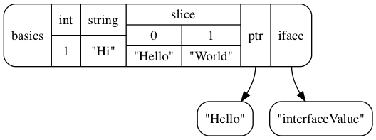

## I tried using memviz

### Install

memviz

```sh
go get -u github.com/bradleyjkemp/memviz
```

graphviz

```sh
brew install graphviz
```

### Run


```go
package main

import (
	"bytes"
	"fmt"

	"github.com/bradleyjkemp/memviz"
)

type basics struct {
	int    int
	string string
	slice  []string
	ptr    *string
	iface  interface{}
}

func main() {
	str := "Hello"
	b := &basics{
		1,
		"Hi",
		[]string{"Hello", "World"},
		&str,
		"interfaceValue",
	}

	buf := &bytes.Buffer{}
	memviz.Map(buf, b)
	fmt.Println(buf.String())
}
```

```sh
go run main.go > hoge.dot

# create png
dot -Tpng hoge.dot -o hoge.png
```



### See

+ https://github.com/bradleyjkemp/memviz
+ http://www.graphviz.org/
